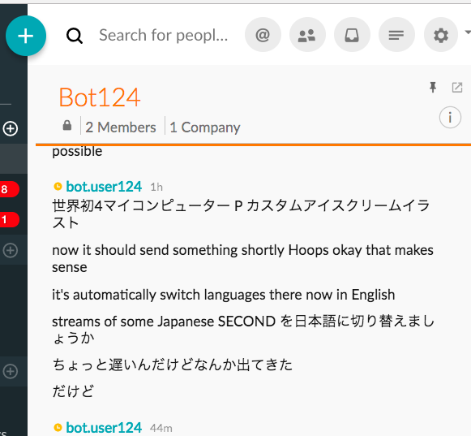

# maestro
This is a Symphony speech to text bot developed during a hackathon.
It uses google cloud for speech to text conversion.

# Client
This uses the symphony client for clojure: <https://github.com/symphonyoss/clj-symphony>

# Usage

This requires java 8, clojure, leiningen, a google cloud account, and a symphony account.

## Environment Variables

Need to set the following environment variables:

* GOOGLE_APPLICATION_CREDENTIALS - the credentials file path for google cloud
* SYMPHONY_PARAMS_EDN - path of an EDN file containing the symphony client config, as explained in the clj-symphony and java symphony clients

## Symphony EDN configuration template

Note that the format may change, depending on the symphony client API. Please refer to the API for the official doc. This info is provided as a sample of what worked for this project.

    {:session-auth-url "https://PODNAME-api.symphony.com:nnnn/sessionauth"
     :key-auth-url "https://PODNAME-api.symphony.com:nnnn/keyauth"   
     :agent-api-url "https://PODNAME.symphony.com/agent"
     :pod-api-url "https://PODNAME.symphony.com/pod"
     :trust-store ["/PATH/TO/TRUSTSTORE" "TRUSTSTORE-PASS"]
     :user-cert ["/PATH/TO/BOT-CERT.p12" "BOT-PASS"]
     :user-email "BOT@EMAILADDRESS"}

A trust store can be created using keytool (download and import the certificate of the API host/s).

Also, add the bot to the room which the text should be transcribed to.

## REPL

This works primarily from the leiningen repl:

    lein repl  ;; start the repl
    (start)    ;; start the server
    (maestro.symphbot/async-transcribe)  ;; start transcribing!
    (maestro.symphbot/set-lang! "ja-JP") ;; switch to Japanese
    (maestro.symphbot/set-lang! "en-US") ;; switch back to English
    quit       ;; stop the bot and server

# Limitations
Speech capture is done on the server. For more flexibility, this is better done from the browser.

Recognition is done by sending data chunks. Better buffering/timing can reduce the breaks in audio. Streaming may also improve the quality.

Web interface and websockets integration is not finished. Bot control (start/stop/change language) is not done.

# Information
* This software is a hobby project and not affiliated with Symphony, Google or any other company.
